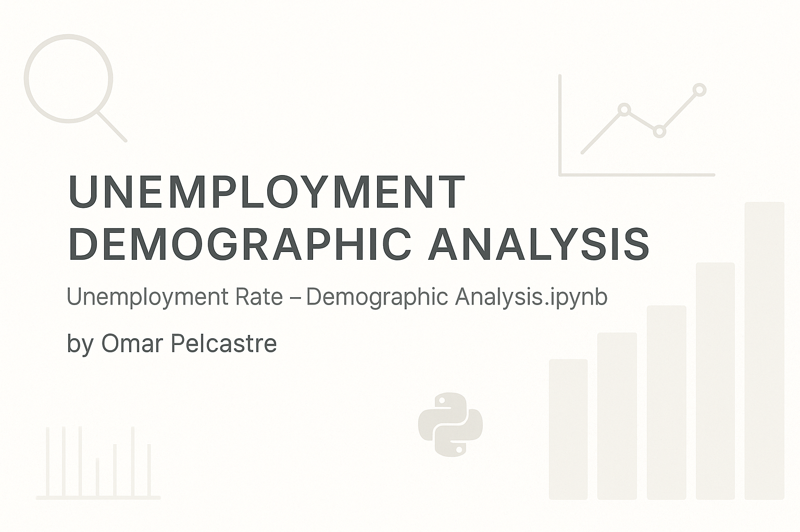
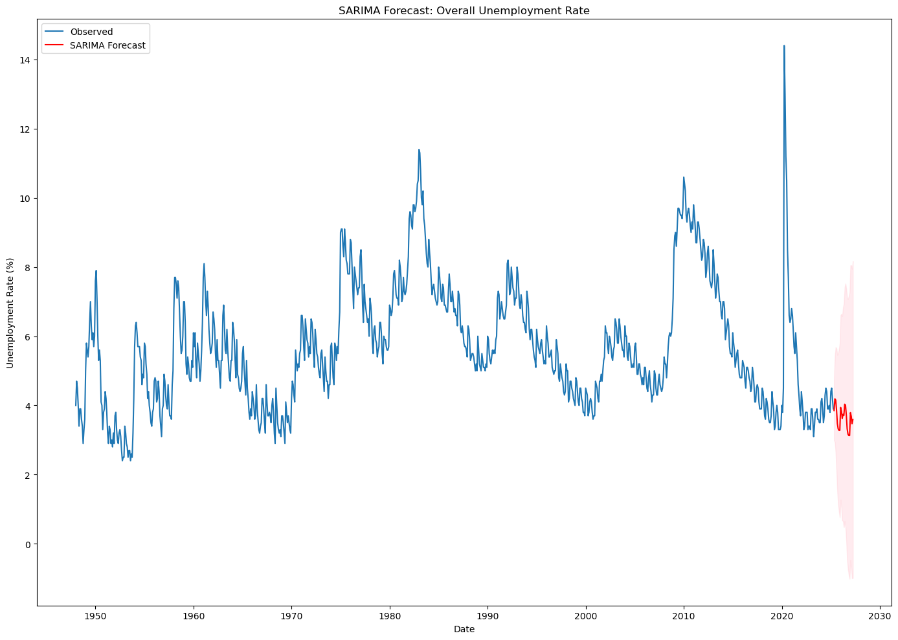
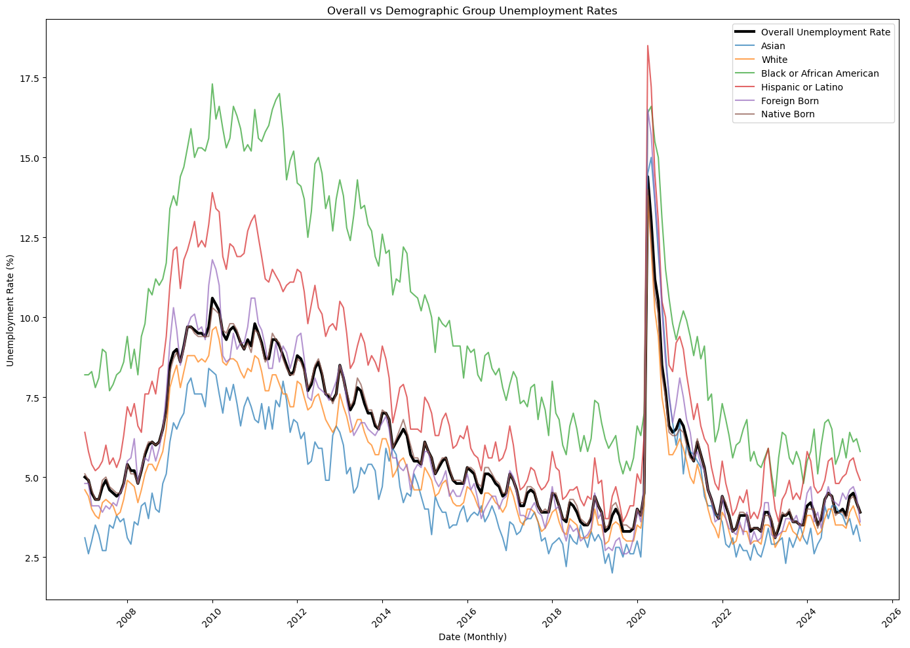

# 📊 Unemployment Demographic Analysis

A time series analysis of U.S. unemployment trends across demographic groups using Python. This project demonstrates forecasting techniques (SARIMA, VAR), statistical visualization, and economic policy contextualization.

---

## 📑 Table of Contents
- [Project Overview](#project-overview)
- [Data Sources](#data-sources)
- [Analysis Workflow](#analysis-workflow)
- [Visual Examples](#visual-examples)
- [Key Takeaways](#key-takeaways)
- [Usage](#usage)
- [Repository Structure](#repository-structure)
- [License](#license)
- [Author](#author)

---

## 🎯 Project Overview

This project analyzes U.S. unemployment rates by age, gender, and race using official economic data. It applies advanced time series models like SARIMA and VAR to forecast future trends and understand the impact of major policy events such as the ARRA, the CARES Act, and the COVID-19 response. The goal is to demonstrate applied skills in economic data science and real-world forecasting.

---

## 📂 Data Sources

- **U.S. Bureau of Labor Statistics (BLS)** – Unemployment data by demographic group  
- **Congressional Budget Office**, **Federal Reserve**, **U.S. Treasury**, **CRS Reports** – For policy context

---

## 🔧 Analysis Workflow

1. Load and clean unemployment data
2. Explore trends across age, sex, and race
3. Conduct time series decomposition
4. Perform stationarity tests (ADF)
5. Apply SARIMA for univariate forecasting
6. Use VAR for multivariate modeling
7. Forecast unemployment and interpret trends
8. Link results to historical policy events

---

## 📈 Visual Examples

#### Forecast Plot (SARIMA)

#### Unemployment by Demographic Group

---

## 🧠 Key Takeaways

- SARIMA and VAR are powerful tools for time series forecasting when used with stationarity checks and proper lag selection.
- Demographic-specific analysis uncovers deeper patterns, such as which groups are most vulnerable during economic downturns.
- Policy interventions (ARRA, CARES Act) correlate with trend reversals in unemployment rates post-recession.

---

## ▶️ Usage

Clone the repository and install dependencies:

git clone https://github.com/o-pelcastre/unemployment-demographic-analysis.git
cd unemployment-demographic-analysis
pip install -r requirements.txt

Launch the Notebook:

jupyter notebook

Or view the HTML version of the final notebook:
📄 [View HTML Analysis](./unemployment_rate_analysis.html)

---

## 📁 Repository Structure
unemployment-demographic-analysis/
├── notebooks/
│   └── Unemployment Rate - Demographic Analysis.ipynb
├── reports/
│   └── Policy_Changes_Unemployment_Summary.txt
├── exports/
│   └── unemployment-analysis.html
├── requirements.txt
├── README.md
└── banner.png  # Optional visual header

---

## 📝 License
This project is licensed under the MIT License — feel free to use, adapt, or share with attribution.

---

## 👤 Author
Omar Pelcastre
📫 [LinkedIn](https://www.linkedin.com/in/opelcastre/)
📁 [Portfolio](https://github.com/o-pelcastre)
🌐 [Website](omarpelcastrecabrera.com)

